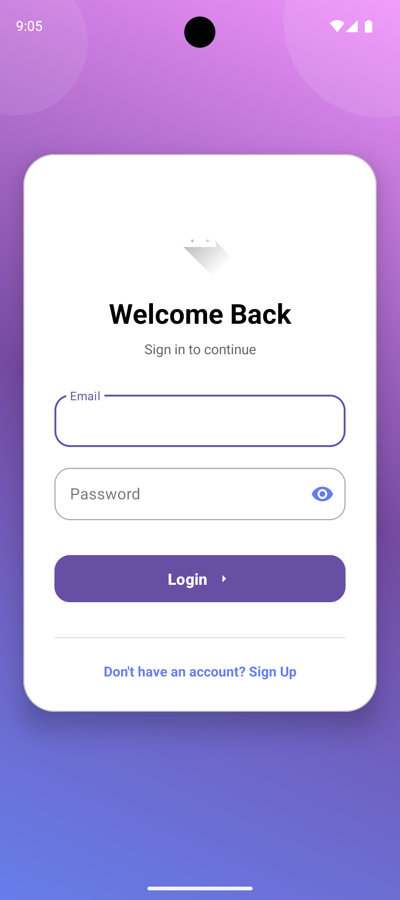
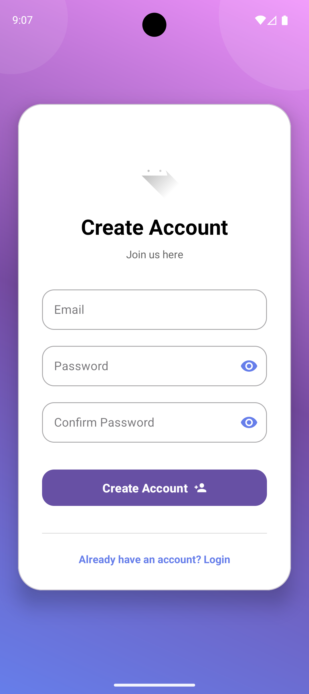
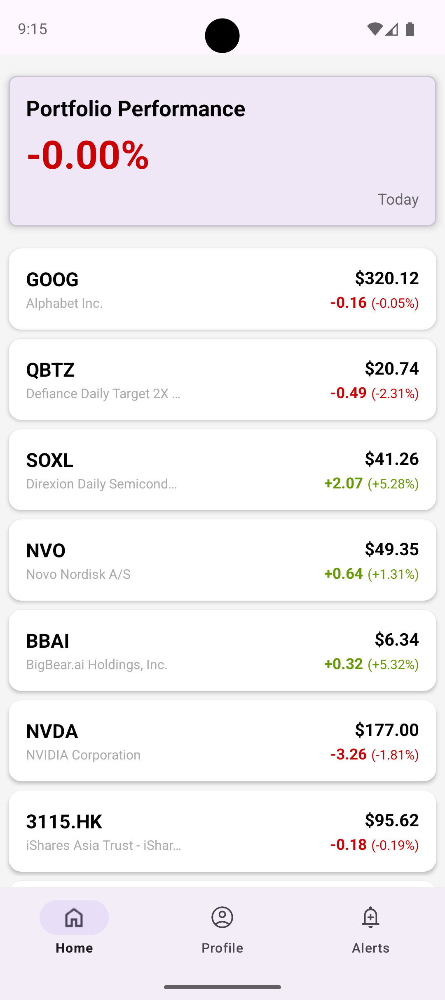
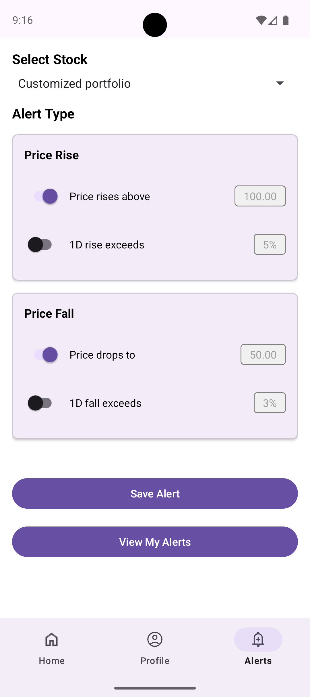
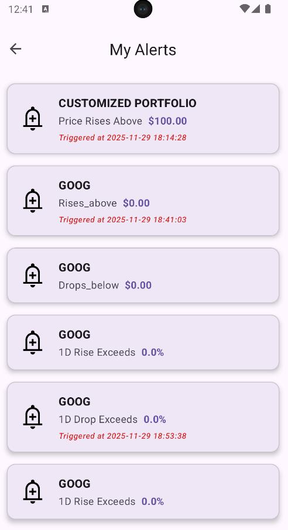
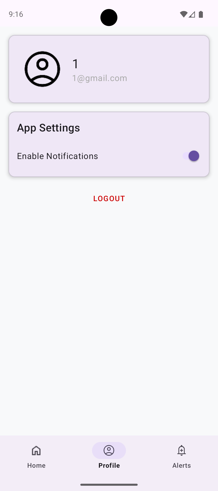

# Portfolio Anomaly Detector (PAD) – US Stocks Overnight Guardian for Hong Kong Investors

[](https://opensource.org/licenses/MIT)


## Project Overview

**Portfolio Anomaly Detector** is a mobile + web application designed specifically for Hong Kong retail investors who actively trade US stocks.  
Because the US market trades from 9:30 PM to 4:00 AM Hong Kong time, many investors wake up to large overnight gaps – either painful drawdowns or missed buying opportunities.

PAD continuously monitors your **entire portfolio** (not just individual tickers) and sends you a concise morning alert when something important happens while you were sleeping.

### Core Problem We Solve
- Overnight “black swan” events can wipe out 10–20% of portfolio value in one night  
- Existing brokerage apps only offer single-asset alerts → blind spots across holdings  
- Retail investors in HK suffered 15–25% higher volatility than benchmarks (2020–2023) due to lack of portfolio-level overnight monitoring

### Current Implemented Features (MVP – Nov 2025 )

| Feature                  | Status   | Description                                                                                   |
|--------------------------|----------|-----------------------------------------------------------------------------------------------|
| Portfolio & Watchlist    | Done     | Add/remove US stocks, set position size & cost basis                                          |
| Portfolio Summary Page   | Done     | Real-time portfolio value, daily P&L, % change, top movers                                    |
| Individual Stock Page    | Done     | Detailed quote, chart, key stats, news headlines                                              |
| Anomaly Detection Engine | Partial  | Rule-based detection (customizable by user):<br>• Single stock drops ≥ X%<br>• Single stock drops below $Y<br>• Entire portfolio drops ≥ X%<br>• Portfolio value falls below $Z |
| Push + Email Notifications | Done  | Immediate push/email when any rule is triggered                                               |
| Alert History Page       | Done     | Complete log of past alerts with timestamp, triggered rule, and affected assets               |
| Real-time Data Pipeline  | Done     | WebSocket connection via yFinance (fallback to REST polling)                                  |
| Time-series Database     | Done     | TimescaleDB for efficient storage and historical queries                                     |


## Screenshots

<div style="display: flex; flex-wrap: wrap; gap: 12px; justify-content: center; margin: 30px 0;">
  
  
  
  
  
  
</div>


1. Portfolio Overview  
2. Stock Detail Page  
3. Custom Alert Rule Creation  
4. Morning Push Notification Example  
5. Alert History

## Tech Stack
 
| Layer              | Technology                                          |
|--------------------|-----------------------------------------------------|
| Mobile Frontend    | Kotlin                                              |
| Web Frontend       | React + Vite (shared UI component logic with mobile)|
| Backend            | Python FastAPI                                      |
| Real-time Data     | REST API                                            |
| Database           | PostgreSQL                                          |
| Notifications      | Firebase Cloud Messaging (FCM) + SMTP               |
| Development Method | Agile (2-week sprints)                              |

## Quick Start (for reviewers)

### Backend
```bash
cd server
python -m venv venv
source venv/bin/activate
pip install -r requirements.txt
python app.py
```

### Mobile (Android)
Open `mobile/` folder in Android Studio → Run on device/emulator


## Current Limitations & Known Issues

- Rule engine is purely threshold-based (no statistical/volatility-adjusted models yet)
- It is not real-time update(it updates every minutes)

